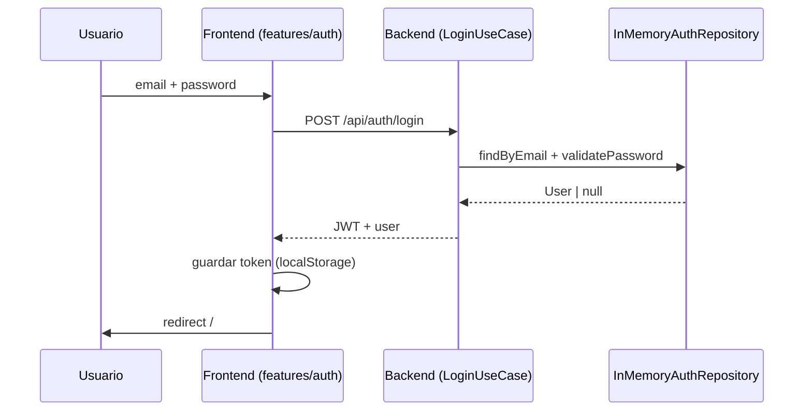

# AGENT.md — Guía de arquitectura para agentes

Este documento define la arquitectura del monorepo **Ataraxia**, una plataforma orientada a **sesiones de psicología** (terapia individual y grupal). Los agentes de IA deben leerlo antes de modificar el código.

## Visión del producto

Ataraxia ayuda a conectar personas con sesiones psicológicas. La fase actual es **fundacional**: autenticación con JWT, persistencia en MongoDB, estructura de capas y convenciones. Los usuarios iniciales se generan mediante un *seed* con contraseñas encriptadas (bcrypt).

## Estructura del monorepo

```
ataraxia.tech/
├── AGENT.md                 ← Este archivo (fuente de verdad arquitectónica)
├── docker-compose.yml       ← mongo + backend + frontend
├── scripts/                 ← up.ps1 / down.ps1 (PowerShell)
├── apps/
│   ├── backend/             ← API REST — Clean Architecture + MongoDB
│   └── frontend/            ← SPA React — Feature-Sliced Design (FSD)
├── .cursor/rules/           ← Reglas persistentes para agentes Cursor
└── package.json             ← npm workspaces
```

## Principios globales

1. **Separación de responsabilidades**: el backend expone contratos HTTP; el frontend consume esos contratos vía `shared/api`.
2. **TypeScript estricto** en ambas apps; no usar `any` salvo justificación documentada.
3. **Dominio primero**: la lógica de negocio vive en `domain/` (backend) o en `entities/` + `features/` (frontend), nunca en controladores ni componentes de UI directamente.
4. **Cambios mínimos**: extender capas existentes antes de crear abstracciones nuevas.
5. **Idioma**: código y tipos en inglés; textos de UI y documentación de producto en español.

---

## Backend — Clean Architecture

**Ubicación:** `apps/backend/src/`

### Capas (dependencias hacia adentro)

```
infrastructure/  →  application/  →  domain/
     ↑                    ↑
  (HTTP, DB)          (DTOs, mappers)
```

| Capa | Responsabilidad | Ejemplos |
|------|-----------------|----------|
| `domain/` | Entidades, interfaces de repositorio y servicios, casos de uso | `User`, `IAuthRepository`, `IPasswordHasher`, `LoginUseCase` |
| `application/` | DTOs de entrada/salida, mapeo entre capas | `LoginRequestDto`, `AuthResponseDto` |
| `infrastructure/` | Express, MongoDB, JWT, bcrypt, config, composition root | `AuthController`, `MongoAuthRepository`, `BcryptPasswordHasher`, `container.ts` |

### Reglas de capa

- `domain/` **no importa** de `infrastructure/` ni de `application/`.
- Los casos de uso reciben **interfaces** (repositorios, servicios), no implementaciones concretas.
- El *wiring* de dependencias vive solo en `infrastructure/container.ts`. Controladores y middleware reciben sus dependencias por parámetro (no instancian repos).
- Los controladores HTTP solo: validan entrada → llaman caso de uso → mapean respuesta.
- Nuevas features de backend: crear entidad → interfaz de repo → caso de uso → implementación infra → registrar en `container.ts` → ruta.

### Autenticación actual

- Persistencia en **MongoDB** (`MongoAuthRepository`), colección `users`.
- Contraseñas encriptadas con **bcrypt** (`BcryptPasswordHasher`); la verificación ocurre en `LoginUseCase`.
- *Seed* inicial de usuarios al arrancar si la colección está vacía (`seedUsers`).
- JWT firmado con `JWT_SECRET`.
- Endpoints: `POST /api/auth/login` → `{ email, password }` → `{ token, user }`; `GET /api/auth/me`.

### Convenciones de nombres

- Casos de uso: `{Accion}UseCase` (ej. `LoginUseCase`)
- Repositorios: `I{Nombre}Repository` (interfaz), `{Impl}{Nombre}Repository` (implementación)
- Controladores: `{Recurso}Controller`

---

## Frontend — Feature-Sliced Design (FSD)

**Ubicación:** `apps/frontend/src/`

### Capas (de abajo hacia arriba)

```
shared → entities → features → pages → app
```

| Capa | Responsabilidad | Ejemplos |
|------|-----------------|----------|
| `shared/` | UI primitiva, API client, utilidades, config | `Button`, `apiClient`, `routes` |
| `entities/` | Modelos de dominio UI, tipos compartidos | `user/types`, `session/types` (futuro) |
| `features/` | Acciones de usuario autocontenidas | `auth/login` |
| `pages/` | Composición de features por ruta | `login-page`, `dashboard-page` |
| `app/` | Router, providers globales, estilos base | `App.tsx`, `RouterProvider` |

### Reglas FSD

- Una capa **solo importa de capas inferiores** (ej. `features` puede usar `entities` y `shared`, nunca `pages`).
- **Prohibido** importar entre slices del mismo nivel (ej. `features/auth` no importa de `features/sessions`).
- Estado de servidor / fetch: en `features/{slice}/api/` o `shared/api/`.
- Componentes de página solo componen; la lógica va en `features/`.

### Rutas actuales

| Ruta | Página | Acceso |
|------|--------|--------|
| `/login` | Login | Público |
| `/` | Dashboard (placeholder) | Autenticado |

---

## Flujo de autenticación



---

## Cómo extender el proyecto

### Nueva entidad de dominio (ej. `Session`)

**Backend:**
1. `domain/entities/Session.ts`
2. `domain/repositories/ISessionRepository.ts`
3. `domain/use-cases/` (ej. `CreateSessionUseCase`)
4. `infrastructure/persistence/` (implementación)
5. `infrastructure/http/` (controller + routes)

**Frontend:**
1. `entities/session/` (types, model)
2. `features/session/create/` (formulario + API)
3. `pages/sessions-page/`
4. Registrar ruta en `app/providers/router`

### Sustituir auth hardcodeada por DB real

1. Implementar `IAuthRepository` con el ORM elegido en `infrastructure/persistence/`.
2. No modificar `LoginUseCase` si la interfaz se mantiene.
3. Actualizar variables de entorno documentadas en `apps/backend/.env.example`.

---

## Comandos de desarrollo

### Local (requiere MongoDB accesible en `MONGO_URI`)

```bash
npm install          # raíz — instala todos los workspaces
npm run dev          # backend :3001 + frontend :5173
npm run dev:backend
npm run dev:frontend
npm run build
npm run typecheck
```

### Docker (stack completo: mongo + backend + frontend)

```powershell
./scripts/up.ps1            # levanta el stack en segundo plano
./scripts/up.ps1 -Build     # reconstruye imágenes
./scripts/up.ps1 -Logs      # levanta y muestra logs
./scripts/down.ps1          # detiene (conserva datos)
./scripts/down.ps1 -Volumes # detiene y borra la base de datos
```

- Frontend: http://localhost:5173
- Backend: http://localhost:3001/health
- MongoDB: `mongodb://localhost:27017`

### Variables de entorno

- Backend: `apps/backend/.env` (ver `.env.example`).
- Frontend: `apps/frontend/.env` (ver `.env.example`).

### Credenciales de prueba (seed)

| Campo | Valor |
|-------|-------|
| Email | `psicologo@ataraxia.tech` / `paciente@ataraxia.tech` / `admin@ataraxia.tech` |
| Password | valor de `SEED_DEFAULT_PASSWORD` (por defecto `Ataraxia2024!`) |

---

## Checklist para agentes antes de un PR

- [ ] ¿La lógica de negocio está en `domain/` (backend) o `features/`/`entities/` (frontend)?
- [ ] ¿Se respetaron las dependencias de capa?
- [ ] ¿Se añadieron tipos TypeScript explícitos?
- [ ] ¿Los textos de UI están en español?
- [ ] ¿Se actualizó este `AGENT.md` si cambió la arquitectura?
