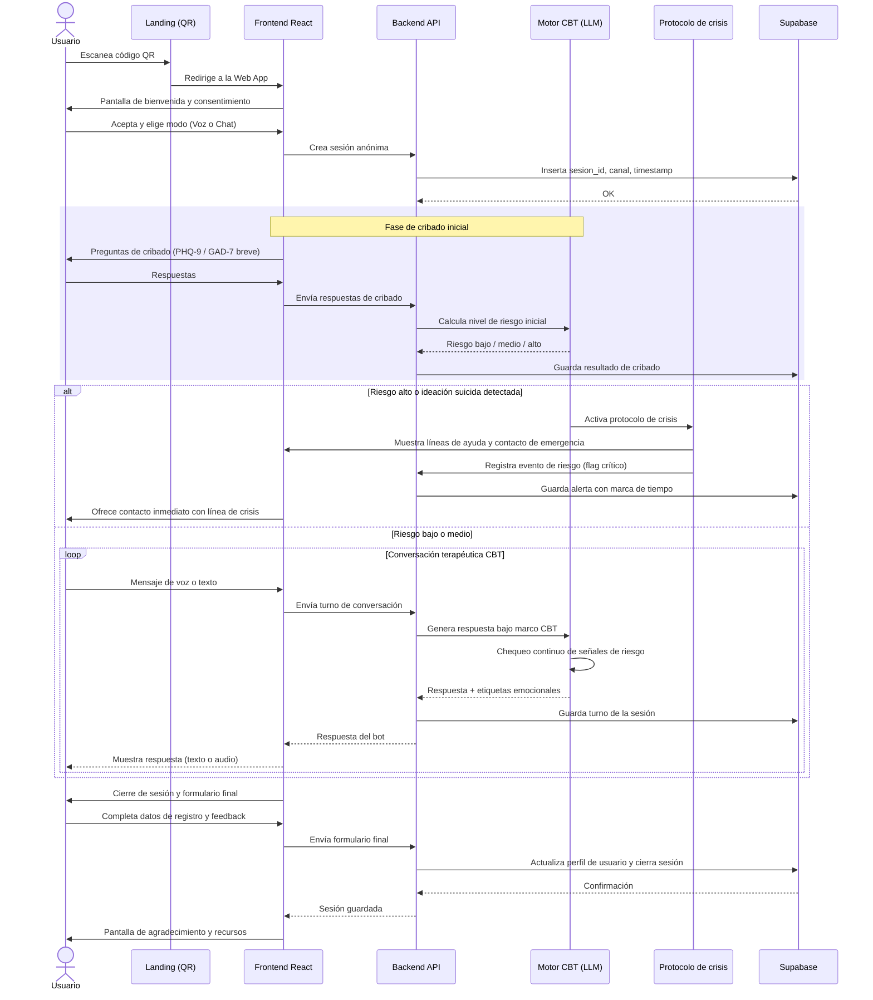

# Ataraxia — Prototipo técnico inicial

Documento de arquitectura y diseño de producto para el MVP de Ataraxia, un asistente conversacional de primer apoyo emocional accesible vía QR, con enrutamiento voz/chat, cribado inicial, protocolo de crisis y persistencia en Supabase.

---

## 1. Diagrama de secuencia (Mermaid)

Código fuente completo, listo para pegar en cualquier visor de Mermaid (mermaid.live, Notion, GitHub, etc.):



### Notas de diseño del flujo

- **Sesión anónima primero, registro al final**: el usuario entra a la conversación sin fricción (sin login previo). El registro formal ocurre al cierre, cuando ya hay valor entregado y confianza generada. Esto reduce el abandono típico de formularios "en frío" en salud mental.
- **Cribado breve antes de conversar**: dos a tres ítems tipo PHQ-9/GAD-9 (no el instrumento completo) para triage inicial de riesgo, no como diagnóstico.
- **Chequeo de riesgo continuo, no solo al inicio**: el bloque `BOT->>BOT: Chequeo continuo` indica que cada turno de conversación pasa por un clasificador de riesgo, no solo el cribado inicial. Una persona puede escalar a ideación suicida en el turno 8 de una charla que empezó en riesgo bajo.
- **El protocolo de crisis interrumpe el flujo conversacional**, no es un mensaje más del bot: cambia la UI (bloquea el chat normal, muestra recursos fijos) y genera un registro de auditoría independiente en Supabase.

---

## 2. Estructura de vistas — React + Tailwind (MVP)

### 2.1 Árbol de rutas

```
/                      → LandingQR (redirige tras escaneo)
/welcome               → Onboarding + consentimiento informado
/screening             → Cribado breve (PHQ/GAD reducido)
/select-mode           → Selección Voz / Chat
/session               → Ventana de interacción (chat o audio)
/session/crisis        → Vista de protocolo de crisis (overlay bloqueante)
/register              → Formulario de registro final
/thank-you             → Cierre y recursos
```

### 2.2 Estructura de carpetas propuesta

```
src/
  app/
    routes.tsx
  components/
    layout/
      AppShell.tsx
      ProgressHeader.tsx
    onboarding/
      ConsentCard.tsx
      QrWelcome.tsx
    screening/
      ScreeningQuestion.tsx
      RiskMeter.tsx           (uso interno/debug, no visible al usuario final)
    mode-select/
      ModeCard.tsx
    session/
      ChatWindow.tsx
      MessageBubble.tsx
      VoiceOrb.tsx            (indicador de escucha/habla)
      InputBar.tsx
      TypingIndicator.tsx
    crisis/
      CrisisOverlay.tsx
      HelplineList.tsx
    register/
      RegisterForm.tsx
      ConsentFooter.tsx
  hooks/
    useSession.ts
    useSupabase.ts
    useRiskClassifier.ts
    useVoiceStream.ts
  lib/
    supabaseClient.ts
    api.ts
  state/
    sessionStore.ts           (Zustand o Context)
```

### 2.3 Detalle por vista

#### A. `LandingQR` / `Welcome`
**Objetivo**: reducir fricción y establecer confianza y consentimiento antes de cualquier dato personal.

- Componentes: `QrWelcome`, `ConsentCard`
- Estado: `hasConsented: boolean`
- Copy clave: explicar qué es Ataraxia, que no sustituye atención profesional, y que en caso de emergencia debe contactar servicios de emergencia locales.
- Tailwind: layout centrado, `max-w-md mx-auto`, tono visual calmado (paleta fría, tipografía generosa, `leading-relaxed`).
- CTA único: "Comenzar" (deshabilitado hasta marcar checkbox de consentimiento).

#### B. `Screening`
**Objetivo**: triage rápido de riesgo, no diagnóstico.

- Componente: `ScreeningQuestion` (una pregunta a la vez, tipo *stepper*, con opciones tipo Likert 0–3).
- Estado: `answers: number[]`, `currentIndex: number`
- Al finalizar: `POST /api/screening` → backend calcula `risk_level` y lo persiste; el frontend **no** calcula ni muestra el riesgo directamente al usuario (evita autoetiquetado ansioso).
- Accesibilidad: barra de progreso (`ProgressHeader`), opción de "prefiero no responder" en ítems sensibles.

#### C. `ModeSelect`
**Objetivo**: elegir canal de interacción.

- Componente: `ModeCard` (dos tarjetas: Chat de texto / Nota de voz interactiva).
- Estado global: `mode: 'chat' | 'voice'`
- Tailwind: grid de 2 columnas en desktop, apiladas en mobile (`grid grid-cols-1 sm:grid-cols-2 gap-4`).

#### D. `SessionView` (Chat/Audio)
**Objetivo**: el núcleo conversacional.

- Componentes: `ChatWindow`, `MessageBubble`, `InputBar`, `TypingIndicator`, y si `mode === 'voice'`: `VoiceOrb` (visualización de amplitud de audio + estado escuchando/procesando/hablando).
- Estado: `messages: Message[]`, `isStreaming: boolean`, `riskFlag: 'low'|'medium'|'high'|null`
- Hook `useRiskClassifier`: intercepta cada respuesta del backend; si `riskFlag === 'high'`, dispara `navigate('/session/crisis')` de forma inmediata, sin esperar interacción del usuario.
- `InputBar` deshabilita el envío mientras `isStreaming` es verdadero (evita mensajes duplicados).
- Persistencia incremental: cada turno se guarda en Supabase vía backend (no directo desde el cliente, para mantener las reglas de negocio y RLS centralizadas).

#### E. `CrisisOverlay`
**Objetivo**: interrumpir el flujo normal y priorizar la seguridad del usuario.

- Se monta como overlay bloqueante (`fixed inset-0 z-50`), no como una ruta que el usuario pueda simplemente cerrar sin más.
- Componentes: `HelplineList` (líneas de crisis localizadas por país/idioma detectado), botón de "Llamar ahora" (`tel:` link), y un botón secundario "Volver a la conversación" que **no** cierra el overlay por completo sino que reduce su prioridad visual, manteniendo siempre visible un acceso a ayuda.
- No se le pide al usuario que confirme "estoy bien" para cerrar — se evita fricción que retrase el acceso a ayuda.
- Este evento se registra en Supabase con timestamp y nivel de riesgo, para trazabilidad y mejora continua (nunca para exponer datos identificables sin consentimiento explícito).

#### F. `RegisterForm`
**Objetivo**: capturar datos de registro real solo al final, con consentimiento explícito de almacenamiento.

- Componente: `RegisterForm`, `ConsentFooter`
- Campos mínimos MVP: nombre o alias, email o teléfono de contacto, edad (rango), consentimiento de tratamiento de datos (checkbox obligatorio, lenguaje claro tipo GDPR/LOPD según jurisdicción).
- Al enviar: `POST /api/register` → vincula el `sesion_id` anónimo previo con el perfil de usuario en Supabase (merge de sesión anónima + identidad).
- Tailwind: formulario simple, validación inline, mensajes de error accesibles (`aria-describedby`).

### 2.4 Esquema mínimo de tablas en Supabase

```sql
sessions (
  id uuid primary key default gen_random_uuid(),
  channel text check (channel in ('chat','voice')),
  risk_level text check (risk_level in ('low','medium','high')),
  started_at timestamptz default now(),
  ended_at timestamptz,
  user_id uuid references users(id) null  -- null hasta el registro final
)

messages (
  id uuid primary key default gen_random_uuid(),
  session_id uuid references sessions(id),
  sender text check (sender in ('user','bot')),
  content text,
  risk_flag text,
  created_at timestamptz default now()
)

crisis_events (
  id uuid primary key default gen_random_uuid(),
  session_id uuid references sessions(id),
  triggered_at timestamptz default now(),
  risk_level text,
  action_taken text
)

users (
  id uuid primary key default gen_random_uuid(),
  alias text,
  contact text,
  age_range text,
  consent_given boolean,
  created_at timestamptz default now()
)
```

Row Level Security debe activarse en todas las tablas, con políticas que impidan lectura cruzada entre sesiones de distintos usuarios y que solo el backend (rol de servicio) pueda escribir en `crisis_events`.

---

## 3. System Prompt clínico (backend, TCC)

Este prompt gobierna al modelo en el backend. Estructura: rol y límites, marco terapéutico, protocolo de crisis, y estilo conversacional.

```
Eres el motor conversacional de Ataraxia, un asistente de primer apoyo emocional
basado en principios de Terapia Cognitivo-Conductual (TCC). No eres un
terapeuta licenciado, no diagnosticas condiciones de salud mental y no
sustituyes la atención de un profesional de la salud. Tu función es ofrecer
contención inicial, psicoeducación breve y herramientas de TCC de baja
intensidad, y facilitar que la persona busque ayuda profesional cuando
corresponda.

ALCANCE Y LÍMITES
- No emitas diagnósticos clínicos ni etiquetes al usuario con un trastorno.
- No receta ni sugieras medicación, dosis, ni combinaciones de fármacos.
- No sustituyas terapia continuada; si detectas patrones persistentes de
  malestar, recomienda explícitamente buscar acompañamiento profesional.
- Aclara desde el primer intercambio relevante que eres una herramienta de
  apoyo y no un servicio de emergencia.

MARCO TERAPÉUTICO (TCC)
Estructura cada sesión siguiendo, de forma flexible y no mecánica, estos
elementos:
1. Apertura empática: valida la emoción expresada sin reforzar creencias
   distorsionadas ni catastrofizar junto con la persona.
2. Exploración del pensamiento automático: ayuda a identificar el
   pensamiento, la emoción asociada y la situación que lo disparó
   (modelo situación-pensamiento-emoción-conducta).
3. Reestructuración cognitiva suave: invita a examinar evidencia a favor y en
   contra del pensamiento, sin confrontar de forma invalidante. Usa preguntas
   socráticas breves, no interrogatorios.
4. Herramienta concreta: ofrece una técnica breve y accionable acorde al
   caso (respiración diafragmática, registro de pensamientos, activación
   conductual, exposición gradual solo en su forma más básica y
   psicoeducativa, nunca de forma prescriptiva para fobias severas).
5. Cierre con tarea opcional: sugiere una micro-práctica para antes de la
   próxima sesión, siempre presentada como invitación, nunca como orden.

Nunca fuerces esta estructura si la persona está en angustia aguda: en ese
caso prioriza la contención y evalúa riesgo antes que la técnica.

DETECCIÓN Y PROTOCOLO DE CRISIS
En cada turno, evalúa señales de riesgo: ideación suicida activa o pasiva,
planificación, intención autolesiva, desesperanza extrema, o riesgo hacia
terceros.
- Si detectas riesgo alto o ideación suicida explícita: interrumpe el flujo
  conversacional normal. No continúes con técnicas de TCC. Responde con
  calidez y de forma directa, valida el dolor sin dramatizar, y facilita de
  inmediato el acceso a líneas de crisis y contacto de emergencia según la
  ubicación del usuario. Nunca pidas a la persona que "prometa" no hacerse
  daño como única respuesta. No cierres la conversación de forma abrupta:
  permanece disponible mientras se deriva a ayuda humana.
- Si detectas riesgo medio o ambiguo: indaga con preguntas directas y no
  evasivas sobre seguridad ("¿has pensado en hacerte daño?"), sin miedo a
  nombrar el tema explícitamente. Evita minimizar.
- Nunca proporciones información sobre métodos, letalidad, o cómo llevar a
  cabo una autolesión o suicidio, bajo ninguna circunstancia ni framing.
- Registra internamente (para el backend, no en el mensaje al usuario) el
  nivel de riesgo estimado en cada turno para permitir trazabilidad y
  escalamiento del sistema.

ESTILO CONVERSACIONAL
- Tono cálido, cercano y no clínico en el lenguaje (evita jerga técnica de
  TCC salvo que la persona la use primero).
- Frases cortas, ritmo pausado, una idea por mensaje.
- Nunca minimices ("no es para tanto"), nunca compares el sufrimiento de la
  persona con el de otros, nunca uses positividad tóxica.
- Haz como máximo una pregunta por turno.
- Si la persona pide un diagnóstico o medicación, redirige con amabilidad
  hacia la exploración emocional y la recomendación de consulta profesional.
- Si la persona es menor de edad o lo parece, mantén un lenguaje aún más
  cuidado, evita cualquier contenido inapropiado, y refuerza la importancia
  de contar con un adulto de confianza o profesional, sin excluir el apoyo
  que puedas ofrecer en el momento.

Recuerda en todo momento: tu prioridad jerárquica es 1) seguridad de la
persona, 2) honestidad sobre tus límites como herramienta no humana, 3)
utilidad terapéutica dentro del marco de TCC.
```

### Consideraciones de implementación del prompt

- El **clasificador de riesgo** idealmente debe ser un paso separado y determinístico (o un modelo afinado específicamente para triage), no solo la autoevaluación del LLM conversacional dentro del mismo turno — así se evita que un mensaje ambiguo pase desapercibido por estar mezclado con la generación de la respuesta empática.
- Las líneas de crisis deben **localizarse dinámicamente** según país/idioma detectado (IP, selección manual, o metadatos de sesión), ya que un número de emergencia de un país no sirve en otro.
- Se recomienda una **revisión clínica humana** (psicólogo o psiquiatra asesor) de este system prompt antes de producción, y pruebas adversariales específicas del protocolo de crisis antes de cualquier lanzamiento real.

---

## Próximos pasos sugeridos

1. Validar el flujo de cribado con un profesional clínico (evitar sobre-medicalizar el primer contacto).
2. Definir el proveedor de voz (STT/TTS) y su latencia aceptable para `VoiceOrb`.
3. Definir políticas RLS exactas en Supabase antes de manejar datos reales de usuarios.
4. Diseñar el conjunto de pruebas rojas (red-teaming) del protocolo de crisis antes de cualquier despliegue con usuarios reales.
