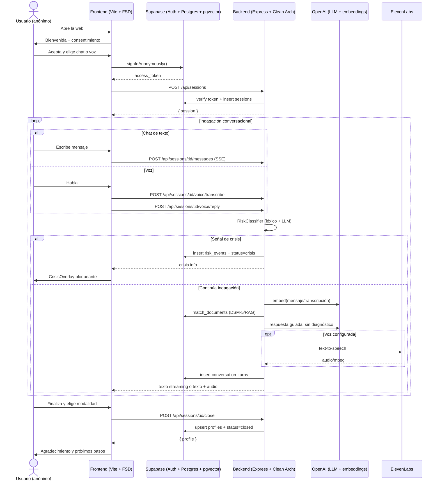

# Ataraxia — Prototipo técnico (MVP)

Documento de referencia del flujo clínico conversacional: diagrama de secuencia,
estructura de vistas del frontend y reglas del prompt clínico.

> **Aviso clínico.** El system prompt, el corpus DSM-5/RAG y el protocolo de
> crisis requieren revisión profesional y red-teaming antes de cualquier
> despliegue real. Ataraxia no diagnostica ni receta y no sustituye la atención
> profesional.

---

## 1. Diagrama de secuencia



**Principios del flujo:**

- La sesión es anónima hasta el registro final.
- No hay formularios PHQ-9/GAD-7 como entrada inicial.
- El RAG DSM-5/material autorizado guía preguntas breves de indagación, no
  diagnósticos.
- El chequeo de riesgo es continuo para texto y transcripciones de voz.

---

## 2. Frontend

Máquina de estados (`features/session/model/useTherapyFlow`):

`welcome → mode → chat/voice intake ⇄ crisis → registration → thankyou`

```
apps/frontend/src/
├── entities/
│   └── session/        # Session, RiskLevel, CrisisInfo
├── features/
│   ├── session/        # useTherapyFlow + session API
│   ├── chat/           # ChatWindow + texto/voz
│   ├── crisis/         # CrisisOverlay bloqueante
│   └── registration/   # RegistrationForm
├── pages/
│   ├── welcome/
│   ├── mode-select/    # Chat / Voz
│   ├── therapy/
│   └── thank-you/
└── shared/
    ├── supabase/
    └── api/
```

Componentes clave:

- **ModeSelectPage**: permite chat o voz desde MVP.
- **ChatWindow**: soporta texto y, en modo voz, transcripción + reproducción de
  audio si el backend la devuelve.
- **CrisisOverlay**: pantalla bloqueante con líneas de ayuda.

---

## 3. Backend y datos

Endpoints protegidos por `Authorization: Bearer <supabase access token>`:

- `POST /api/sessions`
- `POST /api/sessions/:id/messages`
- `POST /api/sessions/:id/voice/transcribe`
- `POST /api/sessions/:id/voice/reply`
- `POST /api/sessions/:id/close`

Esquema mínimo de Supabase:

- `sessions`
- `conversation_turns`
- `risk_events`
- `profiles`
- `documents` / `document_sections`

`risk_events.source` distingue `message` y `voice_transcript`. `profiles` puede
guardar `clinical_summary`, pero no diagnósticos automáticos.

---

## 4. Prompt clínico

El prompt vive en `apps/backend/src/infrastructure/ai/prompts/cbtSystemPrompt.ts`.
Reglas principales:

- No diagnosticar, no recetar, no etiquetar a la persona.
- Hacer una pregunta breve a la vez.
- Usar DSM-5/RAG como guía interna de indagación, no como conclusión.
- No convertir la conversación en un cuestionario.
- Activar protocolo de crisis ante ideación suicida, autolesión o riesgo a
  terceros.

---

## 5. Pendientes críticos antes de producción

- Revisión clínica profesional del prompt, corpus RAG y protocolo de crisis.
- Red-teaming de crisis y de lenguaje diagnóstico.
- Validación de líneas de ayuda del país objetivo.
- Ingesta de corpus DSM-5/material clínico autorizado con licencia adecuada.
