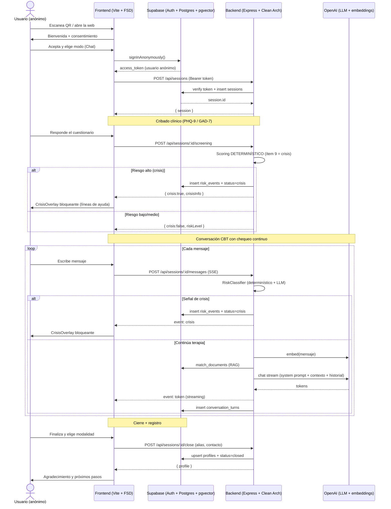

# Ataraxia — Prototipo técnico (MVP)

Documento de referencia del flujo clínico: diagrama de secuencia, estructura de
vistas del frontend y el system prompt clínico (TCC) que gobierna al agente.

> **Aviso clínico.** El system prompt y el protocolo de crisis son un punto de
> partida y **requieren revisión por un profesional clínico y pruebas de
> red-teaming** antes de cualquier despliegue real. Ataraxia no diagnostica ni
> receta y no sustituye la atención profesional.

---

## 1. Diagrama de secuencia (flujo completo)



**Por qué así:**
- La sesión es **anónima hasta el registro final**: reduce fricción y protege la
  privacidad en el momento más vulnerable.
- El chequeo de riesgo es **continuo** (en el cribado y en cada turno), no solo al
  inicio: el estado emocional puede cambiar durante la conversación.
- El scoring del cribado es **determinístico** (el ítem 9 del PHQ-9 dispara crisis
  sin depender del LLM). El LLM es un clasificador secundario, nunca el único juez.

---

## 2. Estructura de vistas (Frontend, FSD)

Rutas:
- `/` → flujo terapéutico (máquina de estados anónima).
- `/staff/login`, `/staff` → consola de staff (temporal, se migrará a Supabase Auth).

Máquina de estados del flujo (`features/session/model/useTherapyFlow`):

`welcome → mode → screening → chat ⇄ crisis → registration → thankyou`

```
apps/frontend/src/
├── entities/
│   ├── session/        # tipos: Session, RiskLevel, CrisisInfo
│   └── screening/      # instrumentos PHQ-9 / GAD-7
├── features/
│   ├── session/        # useTherapyFlow (estado + API del flujo)
│   ├── screening/      # ScreeningForm (PHQ-9 / GAD-7)
│   ├── chat/           # ChatWindow + useChat (streaming SSE)
│   ├── crisis/         # CrisisOverlay (bloqueante, no descartable)
│   └── registration/   # RegistrationForm (alias + modalidad)
├── pages/
│   ├── welcome/        # consentimiento
│   ├── mode-select/    # Chat (activo) / Voz (Fase 2)
│   ├── therapy/        # controlador del flujo (renderiza el paso actual)
│   └── thank-you/      # cierre
└── shared/
    ├── supabase/       # cliente anon + signInAnonymously
    └── api/            # apiClient + streamAssistantMessage (SSE)
```

Componentes clave:
- **CrisisOverlay**: overlay a pantalla completa, no descartable, con líneas de
  ayuda como enlaces `tel:`. Se muestra cuando el estado es `crisis`.
- **ChatWindow**: burbujas usuario/asistente, respuesta en streaming token a token.
- **ScreeningForm**: PHQ-9 (9 ítems) + GAD-7 (7 ítems), escala 0–3.

Esquema mínimo de Supabase (ver `supabase/migrations/`): `sessions`,
`screening_results`, `conversation_turns`, `risk_events`, `profiles`,
`documents` / `document_sections` (RAG con `pgvector` + RPC `match_documents`),
todo con RLS por `auth.uid()`.

---

## 3. System Prompt clínico (TCC)

El prompt vive en `apps/backend/src/infrastructure/ai/prompts/cbtSystemPrompt.ts`
(fuente de verdad ejecutable). Resumen de sus reglas:

- **Límites de alcance**: no diagnostica, no receta, no atiende temas fuera del
  bienestar emocional; redirige con calidez.
- **Metodología TCC**: modelo situación → pensamiento → emoción → conducta, con
  validación, exploración socrática (una pregunta a la vez) y una sola herramienta
  por turno.
- **Protocolo de crisis**: ante ideación suicida/autolesión, no continúa la terapia
  normal, **no da información de métodos**, **no pide "promesas de seguridad"** y
  deriva de inmediato a ayuda humana mostrando las líneas de crisis.
- **Privacidad**: conversación anónima; no solicita datos personales.

---

## 4. Pendientes críticos antes de producción
- Revisión clínica profesional del system prompt y del protocolo de crisis.
- Red-teaming del protocolo de crisis (fraseos indirectos, jailbreaks).
- Validación de las líneas de ayuda del país objetivo (`CRISIS_HOTLINES`).
- Ingesta de un corpus psicológico con licencia adecuada para el RAG.
